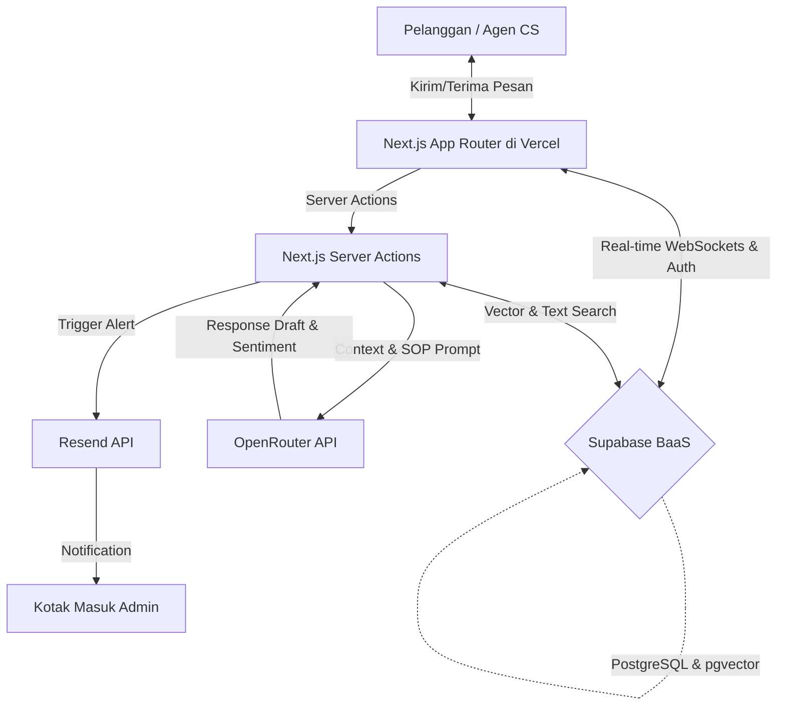
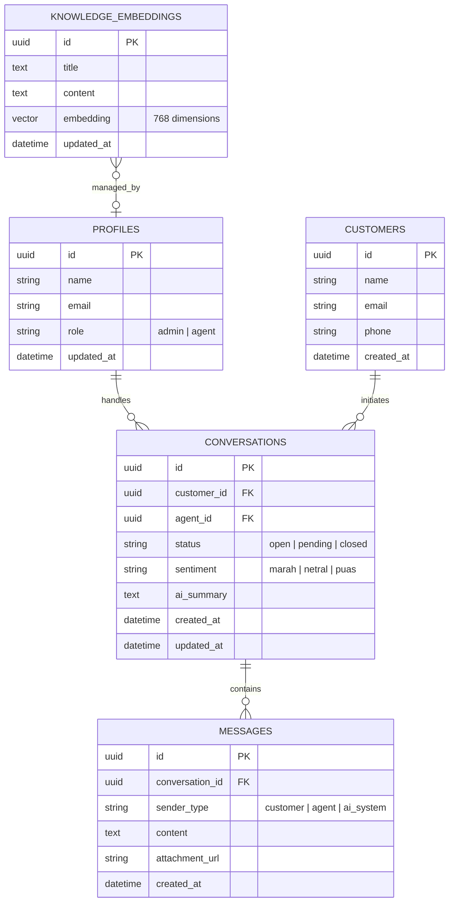

# SynapseCS — AI-Powered Customer Support Platform

[](https://nextjs.org/)
[](https://tailwindcss.com/)
[](https://supabase.com/)
[](https://openrouter.ai/)
[](https://resend.com/)

SynapseCS is a customer support workspace that connects real-time messaging with context-aware AI drafting. The platform helps customer service agents handle large ticket volumes by automating sentiment detection, summarizing long chat histories, and suggesting replies based on internal standard operating procedures (SOPs). The application operates on a serverless stack, running on free-tier services.

---

## 📈 Business Impact & Performance Metrics

Support operations suffer from high response latencies and agent cognitive overload. SynapseCS addresses these issues through targeted automation:

*   **Decreased Mean Time to Resolution (MTTR):** AI-drafted replies based on vector searches reduce response formulation times. Agents verify and edit suggestions instead of searching through PDF manuals.
*   **Reduced Customer Churn:** The system identifies customer frustration (angry sentiment) instantly and escalates these tickets to the top of the queue.
*   **Operational Cost Minimization:** The system runs on a 100% free-tier stack, including Vercel, Supabase, pgvector, OpenRouter, and Resend. This configuration allows organizations to validate support workflows without server cost overhead.
*   **Collison-Free Collaboration:** Real-time state synchronization prevents agents from working on the same ticket simultaneously, reducing duplicate replies.

---

## 🛠️ Tech Stack & Infrastructure

*   **Frontend & Core API:** Next.js 16 (App Router), TypeScript, and React Server Actions.
*   **Styling & UI Components:** Tailwind CSS, Radix UI Primitives, and Lucide Icons.
*   **Database & Security:** Supabase (PostgreSQL, Row-Level Security, and Realtime WebSockets).
*   **Vector Engine:** PostgreSQL `pgvector` extension.
*   **AI Orchestration:** OpenRouter API (routing to free LLM models like `google/gemini-2.0-flash-exp:free`).
*   **Email Routing:** Resend API.

---

## 🏗️ System Architecture & Data Flow

The serverless architecture processes messages, searches vector embeddings, routes AI prompts, and alerts administrators.



### Database Schema

The PostgreSQL schema enforces relationships, user roles, and vector storage:



---

## 💡 Core Features & Engineering Decisions

Here is how each feature operates and the engineering reasons behind its design:

### 1. RAG-Based AI Response Drafts
*   **What it does:** When an agent requests a draft, the system retrieves relevant documents from the knowledge base using vector similarity search, combines them with the chat history, and prompts the LLM to generate a response.
*   **Why it matters:** It keeps responses aligned with corporate policy. It also eliminates manual lookups, preventing agents from offering unauthorized discounts or shipping options.

### 2. Real-Time Workspace Synchronization
*   **What it does:** WebSocket connections synchronize ticket statuses and agent assignments instantly across all dashboards.
*   **Why it matters:** Multi-agent environments experience race conditions where two agents reply to the same customer. Instant state updates ensure clear ticket ownership.

### 3. Automated Sentiment Analysis & Escalation
*   **What it does:** The system analyzes the sentiment of incoming customer messages. If it detects an `angry` sentiment, it updates the ticket priority, inserts an audit log, and emails the administrator via Resend.
*   **Why it matters:** Resolving customer issues quickly prevents negative public reviews. Automated alerts bypass standard response queues for high-risk accounts.

### 4. 3-Point Conversation Summarizer
*   **What it does:** Condenses long conversation threads into three core points: the primary problem, actions taken, and required follow-up.
*   **Why it matters:** During shift handovers or escalations, agents waste time reading historical logs. Summaries reduce context-switching times.

### 5. Audit Logging & Compliance Trails
*   **What it does:** Tracks operational events, such as status transitions, ticket claims, knowledge base updates, and escalations.
*   **Why it matters:** Administrative monitoring prevents account sharing, audits agent workloads, and provides a clear history for compliance.

### 6. Subpath Routing & Micro-Frontend Integration
*   **What it does:** Configures the Next.js `basePath` option to run the entire application under `/synapse-cs`.
*   **Why it matters:** Large organizations host tools under a unified domain. Subpath routing allows deployment behind a reverse proxy (e.g., Nginx, Cloudflare) without path routing conflicts.

---

## 🔍 Technical Deep Dives & Coding Patterns

### Next.js Server Actions & Supabase SSR Session Security

To prevent session leaks and ensure security, SynapseCS utilizes the `@supabase/ssr` library. Traditional serverless environments can leak state across concurrent requests if the client instance is shared globally. SynapseCS creates a localized client instance on every request.

As implemented in [src/utils/supabase/server.ts](file:///E:/_PROJECT/AI%20Customer%20Support%20(synapse-ai)/src/utils/supabase/server.ts):

```typescript
export const createClient = (cookieStore: Awaited<ReturnType<typeof cookies>>) => {
  return createServerClient(
    supabaseUrl!,
    supabaseKey!,
    {
      cookies: {
        getAll() {
          return cookieStore.getAll()
        },
        setAll(cookiesToSet) {
          try {
            cookiesToSet.forEach(({ name, value, options }) => 
              cookieStore.set(name, value, options)
            )
          } catch {
            // Handled when called from Server Components
          }
        },
      },
    },
  );
};
```

This client enforces Row-Level Security (RLS). For instance, the SQL configuration in [supabase/setup.sql](file:///E:/_PROJECT/AI%20Customer%20Support%20(synapse-ai)/supabase/setup.sql) limits access so that agents can read all data, but only admins can modify the knowledge base:

```sql
create policy "Allow read access for authenticated users" on public.knowledge_embeddings
  for select to authenticated using (true);

create policy "Allow admin to manage knowledge embeddings" on public.knowledge_embeddings
  for all to authenticated using (
    (auth.jwt() -> 'user_metadata' ->> 'role') = 'admin'
  );
```

### The Hybrid Vector & Text Retrieval Pipeline

For similarity search, the PostgreSQL database uses `pgvector` to calculate cosine distance. The SQL function `match_knowledge` translates cosine distance into cosine similarity:

$$\text{Similarity} = 1 - \text{Cosine Distance}$$

This query matches against the 768-dimensional embeddings generated by Gemini `text-embedding-004` (configured in [supabase/setup.sql](file:///E:/_PROJECT/AI%20Customer%20Support%20(synapse-ai)/supabase/setup.sql)):

```sql
create or replace function public.match_knowledge (
  query_embedding vector(768),
  match_threshold float,
  match_count int
)
returns table (
  id uuid,
  title text,
  content text,
  similarity float
)
language sql stable
as $$
  select
    id,
    title,
    content,
    1 - (knowledge_embeddings.embedding <=> query_embedding) as similarity
  from knowledge_embeddings
  where 1 - (knowledge_embeddings.embedding <=> query_embedding) > match_threshold
  order by knowledge_embeddings.embedding <=> query_embedding
  limit match_count;
$$;
```

To maintain system functionality during development, testing, or build stages (when external API keys are unavailable), the backend implementation in [src/lib/ai.ts](file:///E:/_PROJECT/AI%20Customer%20Support%20(synapse-ai)/src/lib/ai.ts) handles fallback behavior:

```typescript
export async function searchSOPs(query: string, matchCount = 2, threshold = 0.2) {
  try {
    const supabase = await getSupabaseClient();
    const geminiKey = process.env.GEMINI_API_KEY;
    
    if (geminiKey && !geminiKey.includes("placeholder")) {
      const queryEmbedding = await getEmbedding(query);
      const { data: documents, error } = await supabase.rpc("match_knowledge", {
        query_embedding: queryEmbedding,
        match_threshold: threshold,
        match_count: matchCount,
      });
      if (!error && documents) return documents;
    }

    // Fallback: Text search utilizing ILIKE on title and content fields
    const { data: documents, error } = await supabase
      .from("knowledge_embeddings")
      .select("id, title, content")
      .or(`title.ilike.%${query}%,content.ilike.%${query}%`)
      .limit(matchCount);

    if (error) throw error;
    return (documents || []).map((doc) => ({ ...doc, similarity: 1.0 }));
  } catch (error) {
    console.error("SOP Search failed:", error);
    return [];
  }
}
```

### Concurrency Syncing in Multi-Agent Dashboards

Next.js Server Actions manage database state transitions, while Supabase Realtime notifies listening clients of changes. When an agent updates a ticket's state, [src/app/actions.ts](file:///E:/_PROJECT/AI%20Customer%20Support%20(synapse-ai)/src/app/actions.ts) handles the updates:

```typescript
export async function updateConversationStatusAction(
  conversationId: string,
  status: "open" | "pending" | "closed"
): Promise<boolean> {
  try {
    const cookieStore = await cookies();
    const supabase = createClient(cookieStore);

    const { data: oldConvo } = await supabase
      .from("conversations")
      .select("status")
      .eq("id", conversationId)
      .single();

    const { error } = await supabase
      .from("conversations")
      .update({ status, updated_at: new Date().toISOString() })
      .eq("id", conversationId);

    if (error) throw error;

    await logActivityAction(
      "UPDATE_STATUS",
      `Status updated from ${oldConvo?.status} to ${status}`,
      { conversationId, newStatus: status }
    );
    return true;
  } catch (error) {
    console.error(error);
    return false;
  }
}
```

This updates the database, prompting Supabase's write-ahead log listener to broadcast the event to all active agent interfaces. This updates the local UI state without page reloads.

---

## ⚡ Performance Optimization & Scalability

### 1. Database Indexing
To prevent table scans as database volume increases, the database schema includes indices on search fields, foreign keys, and sorting columns:

```sql
create index if not exists idx_conversations_customer_id on public.conversations(customer_id);
create index if not exists idx_conversations_agent_id on public.conversations(agent_id);
create index if not exists idx_messages_conversation_id on public.messages(conversation_id);
create index if not exists idx_conversations_updated_at on public.conversations(updated_at desc);
create index if not exists idx_messages_created_at on public.messages(created_at asc);
```

### 2. Token Budgeting & Context Optimization
AI requests limit the number of database records retrieved to protect token quotas:
*   **Inbox History:** Renders only the last 50 messages per conversation, reducing database read overhead.
*   **AI Drafting Context:** Retrieves only the last 10 messages, focusing the model's window on current statements.
*   **Summarization Context:** Limits processing to the last 30 messages, preventing model rate limits.

---

## 🛡️ Challenges Solved

### Challenge 1: Local Development Cold Starts (pgvector Mocking)
During database seeding, standard SOP records require vector values to prevent database exceptions. Generating vectors for default mock files requires active API connections during setup.
*   **Solution:** The seed file utilizes a zero-filled vector array generator (`array_fill(0, ARRAY[768])::vector`) to populate the `embedding` fields. The system functions correctly with dummy values, and updates the embeddings when an administrator saves modifications in the application.

### Challenge 2: Parsing Unstructured LLM Outputs
LLMs sometimes return markdown annotations (like ` ```json ` blocks) or conversational introductory text, which breaks strict `JSON.parse` operations.
*   **Solution:** The system parses responses using a regex extraction utility in [src/lib/ai.ts](file:///E:/_PROJECT/AI%20Customer%20Support%20(synapse-ai)/src/lib/ai.ts) to isolate JSON strings:

```typescript
function parseJSONFromText(text: string) {
  try {
    const cleaned = text.replace(/```json/g, "").replace(/```/g, "").trim();
    return JSON.parse(cleaned);
  } catch (e) {
    const match = text.match(/(\{[\s\S]*\}|\[[\s\S]*\])/);
    if (match) {
      try {
        return JSON.parse(match[0]);
      } catch (e2) {}
    }
    throw e;
  }
}
```

---

## 🚀 Getting Started & Runbook

### 1. Clone the Project & Install Dependencies
```bash
git clone https://github.com/DycandX/SynapseCS.git
cd SynapseCS
npm install
```

### 2. Create the Local Environment Configuration
Duplicate `.env.example` to `.env.local` and populate the variables:
```bash
cp .env.example .env.local
```

### 3. Initialize the Database
1.  Access your **Supabase Dashboard**.
2.  Navigate to **SQL Editor** -> **New Query**.
3.  Execute the schema definitions in [supabase/setup.sql](file:///E:/_PROJECT/AI%20Customer%20Support%20(synapse-ai)/supabase/setup.sql).
4.  Execute the seed data script in [supabase/seed.sql](file:///E:/_PROJECT/AI%20Customer%20Support%20(synapse-ai)/supabase/seed.sql).

### 4. Run the Development Server
```bash
npm run dev
```
The interface is accessible at `http://localhost:3000/synapse-cs`.
