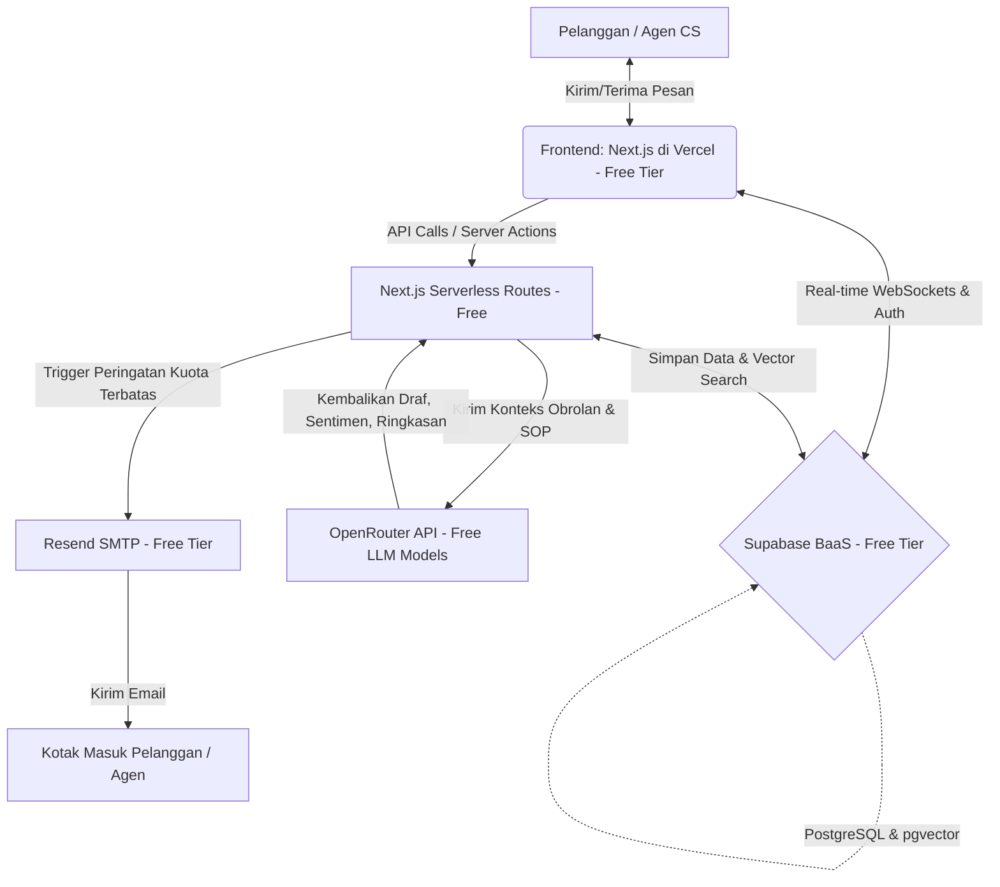
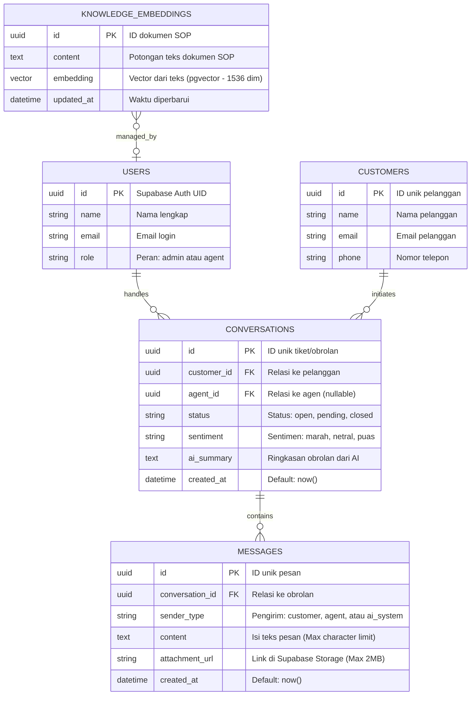

---

# PRD — Project Requirements Document (Free Tier Optimized)

## 1. Overview

**AI Customer Support Inbox** adalah platform manajemen pesan pelanggan cerdas yang dirancang khusus untuk Agen *Customer Service* (CS). Masalah yang sering dihadapi oleh agen CS adalah kewalahan saat harus membaca riwayat obrolan yang panjang, kehilangan konteks pelanggan, dan lambat dalam menyusun balasan yang sesuai dengan SOP perusahaan.

Aplikasi ini hadir untuk memberikan solusi *human-in-the-loop* AI, di mana agen manusia bekerja berdampingan dengan kecerdasan buatan. Dengan aplikasi ini, agen dapat memberikan jawaban yang lebih cepat dan akurat. Nilai utama dari platform ini adalah menghemat waktu agen secara drastis (meningkatkan efisiensi kerja) sekaligus memberikan pengalaman yang lebih responsif bagi pelanggan. Platform ini dirancang secara efisien agar dapat **beroperasi sepenuhnya di atas infrastruktur *free-tier* tanpa biaya langganan harian**.

## 2. Requirements & Free-Tier Constraints

* **Aksesibilitas & Keamanan:** Sistem memiliki pembagian peran (*role-based access*) antara agen CS dan Administrator menggunakan sistem otentikasi terintegrasi yang hemat kuota.
* **Sistem Waktu Nyata (*Real-time*):** Pesan yang masuk dan keluar diperbarui secara *real-time* memanfaatkan teknologi WebSockets bawaan penyedia database gratis tanpa perlu memuat ulang halaman.
* **Integrasi AI Hemat Biaya:** Sistem AI memproses dokumen/SOP internal perusahaan menggunakan metode RAG berbasis *vector database* lokal gratis. Pemanggilan LLM dibatasi oleh *rate-limit* bawaan model gratisan.
* **Sentralisasi Data & Limitasi Storage:** Seluruh saluran komunikasi bermuara pada satu antarmuka dasbor tunggal. Batasan penyimpanan berkas media disesuaikan dengan kuota penyimpanan gratis.
* **Kinerja & Notifikasi:** Sistem mengirimkan peringatan otomatis untuk pesan tertunda atau tiket dengan prioritas tinggi via email dengan pembatasan kuota pengiriman harian.

## 3. Core Features & Cost Optimization

* **Login & Authentication:** Sistem masuk aman untuk agen dan administrator menggunakan *Supabase Auth (Free Tier hingga 50.000 MAU)*.
* **Customer List & Message History:** Menampilkan profil lengkap pelanggan beserta riwayat obrolan masa lalu (dibatasi hanya memuat 50 pesan terakhir per sesi untuk menghemat beban baca database gratis).
* **Conversation Inbox & Attachment Upload:** Dasbor tempat agen membalas pesan. Mendukung pengiriman teks, gambar, dan dokumen. *Optimasi biaya: Ukuran file dibatasi maksimal 2MB per unggahan untuk menghemat kuota Supabase Storage (Maksimal 1GB).*
* **AI Reply Draft (RAG via pgvector):** *Fitur Unggulan.* AI membaca potongan SOP internal perusahaan yang relevan yang disimpan di *Supabase Vector (pgvector)*, lalu membuatkan draf balasan melalui *OpenRouter API (Model Free seperti Llama-3 8B Free)*.
* **AI Sentiment Analysis & Auto-Tagging:** AI mendeteksi sentimen pelanggan (marah/puas) secara otomatis saat pesan pertama kali masuk menggunakan *prompt* ringan pada model gratisan untuk menghindari pemborosan token.
* **AI Conversation Summarizer:** Agen dapat merangkas obrolan yang panjang menjadi 3 poin utama hanya dengan satu klik. *Optimasi biaya: AI hanya membaca maksimal 15-20 baris pesan terakhir agar tidak melewati batas konteks token gratis.*
* **Email Notification:** Sistem pemberitahuan pemicu otomatis menggunakan *Resend (Free Tier hingga 3.000 email/bulan)*. Email dikirim secara selektif hanya untuk tiket darurat.

## 4. User Flow

1. **Masuk ke Dasbor:** Agen CS *login* ke dalam sistem melalui halaman otentikasi.
2. **Prioritas Tugas:** Agen melihat daftar antrean pesan. Pesan dengan label "Marah/Darurat" (hasil analisis sentimen instan dari AI) berada di posisi teratas.
3. **Mendapatkan Konteks:** Agen mengklik pesan tersebut. Di sebelah kanan, dasbor memuat profil pelanggan dan beberapa riwayat pesan terakhir secara efisien.
4. **Membaca Ringkasan:** Agen menekan tombol **"Ringkas Obrolan"**. Sistem mengirimkan potongan obrolan terbaru ke OpenRouter Free API, dan AI langsung memberikan 3 poin utama masalah pelanggan.
5. **Membuat Balasan Cepat:** Agen menekan tombol **"AI Draft"**. Sistem melakukan pencarian kemiripan teks teks (*similarity search*) pada tabel SOP di Supabase, mengirimkan konteksnya ke OpenRouter, dan menyiapkan teks balasan.
6. **Validasi Manusia (*Human-in-the-loop*):** Agen membaca draf tersebut, melakukan sedikit penyesuaian agar lebih personal, lalu menekan "Kirim". Pesan terkirim secara *real-time*.
7. **Notifikasi:** Pelanggan menerima balasan. Jika di luar jam kerja, *Resend* memicu notifikasi email bahwa keluhannya telah ditanggapi.

## 5. Architecture & Free Tech Stack

Sistem ini memangkas biaya server tradisional dengan menggunakan arsitektur *Serverless Backend* yang menyatu dengan *Edge Functions* serta memanfaatkan *Backend-as-a-Service* gratis.

## 6. Database Schema (Optimized for Supabase & pgvector)

Struktur basis data menggunakan PostgreSQL bawaan Supabase. Ditambahkan tabel `knowledge_embeddings` untuk mendukung sistem RAG SOP gratis.

## 7. Concrete Free Tech Stack Selection

Untuk memastikan proyek ini berjalan tanpa biaya sepeser pun, berikut adalah daftar penyedia layanan yang digunakan beserta batasan gratisnya:

* **Frontend Deployment:** **Vercel** (Free Tier: Selamanya gratis untuk personal project, termasuk SSL otomatis).
* **Application Framework:** **Next.js (App Router)** (Memanfaatkan Server Actions untuk menggantikan backend server terpisah).
* **Database & Core Backend:** **Supabase** (Free Tier: Mendukung hingga 2 proyek aktif, database PostgreSQL 500MB, dan fitur *Real-time polling/WebSockets* gratis).
* **Vector DB (RAG):** **pgvector** (Ekstensi bawaan di dalam PostgreSQL Supabase, gratis dan tidak memakan kuota eksternal).
* **Authentication:** **Supabase Auth** (Free Tier: Mendukung hingga 50.000 pengguna aktif bulanan).
* **File Storage (Attachments):** **Supabase Storage** (Free Tier: Kuota penyimpanan hingga 1GB untuk file gambar/dokumen pelanggan).
* **AI Integration:** **OpenRouter API** (Menggunakan model-model bertanda *Free* seperti `meta-llama/llama-3-8b-instruct:free`).
* **Email Service:** **Resend** (Free Tier: Mengizinkan pengiriman hingga 3.000 email per bulan atau 100 email per hari dengan domain kustom).
* **UI Components:** **Tailwind CSS** & **shadcn/ui** (Open source dan gratis sepenuhnya).